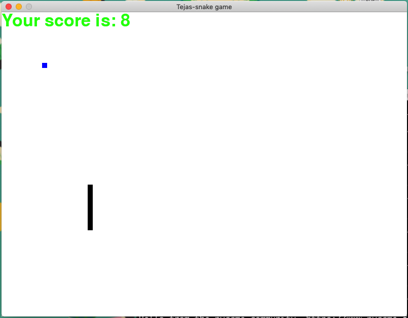

# Snakegame
Snake game made using Python3. This is the first game I have made using the pygame module and KiVy. It is an extremely rudimentary snake game, found on old mobile devices. The purpose and working of the game is simple: eat the food to increase your score and length, and you lose if you bang into any of the 4 surrounding boundaries.

## Getting Started

## Prerequisites

Primarily, a stable version of Python3 is required on the system. In addition, the pygame module is also required before the program can be run.
In case this module is missing, download the same by typing in the terminal or command prompt:
'''
pip install pygame
'''
We should now be good to go

## Installing

After downloading the above repository, run the snakegame.py file, either using the UI or the terminal.
A new window should now pop up, on which the game is to be played.
It will also display a score counter.
The snake is to be controlled using the 4 arrow keys.

The game will look something like this

## Built Using
Kivy on Python3

## Author

Tejas Karnani
Please feel free to contact me in case any issues are faced with the running of this program, mail- tejaskarnani1@gmail.com
Also please check out my other repositories displaying my interesting projects!

